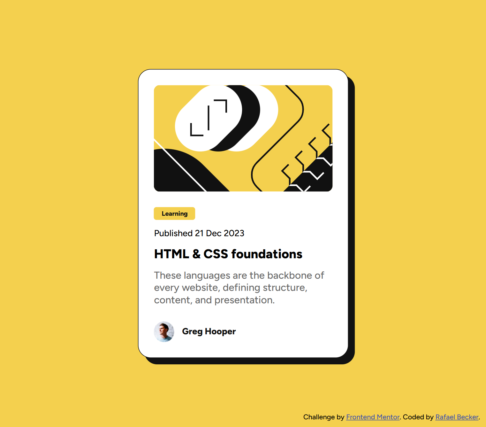

# Frontend Mentor - Blog preview card solution

This is a solution to the [Blog preview card challenge on Frontend Mentor](https://www.frontendmentor.io/challenges/blog-preview-card-ckPaj01IcS). Frontend Mentor challenges help you improve your coding skills by building realistic projects. 

## Table of contents

- [Overview](#overview)
  - [The challenge](#the-challenge)
  - [Screenshot](#screenshot)
  - [Links](#links)
- [My process](#my-process)
  - [Built with](#built-with)
  - [What I learned](#what-i-learned)  
  - [Useful resources](#useful-resources)
- [Author](#author)

## Overview

### The challenge

Users should be able to:

- See hover and focus states for all interactive elements on the page

### Screenshot

### Links

- Solution URL: [https://github.com/realfabecker/mentor/tree/main/blog-preview-card](https://github.com/realfabecker/mentor/tree/main/blog-preview-card)
- Live Site URL: [https://realfabecker.github.io/mentor/blog-preview-card/](https://realfabecker.github.io/mentor/blog-preview-card/)

## My process

### Built with

- Semantic HTML5 markup
- CSS custom properties
- Flexbox

### What I learned

#### Semantic HTML: The Power of `<article>`

A key takeaway was deepening the understanding of the `<article>` element and its role in representing self-contained, independent content.

Initially, the approach involved using `<figure>` and `<figcaption>` to group the blog post content and the author's information (including respective images). However, through development and reflection, it became clear that the use of a single `<article>` was the most semantically correct and simpler solution, as it inherently contains all the self-contained information of a single blog post. The `<footer>` element was then naturally used within the `<article>` to represent the author's metadata. This reinforces the importance of choosing the right semantic tag for the content's meaning.

#### Responsive Typography with CSS clamp()

Styling presented an exciting challenge: making the fonts responsive without relying on CSS media queries.

This led to the exploration of the clamp() CSS function. clamp() is a powerful tool for responsive typography as it allows you to set a minimum value, a preferred value (often calculated using a viewport percentage, like vw), and a maximum value. This ensures the font size scales fluidly based on the viewport width, but never falls below the minimum or exceeds the maximum, achieving truly fluid and controlled responsiveness.

#### Accessibility: Focus States

It was crucial to understand and implement proper focus styling for key interactive elements, such as the blog post title.

Ensuring a clear visual focus state is vital for accessibility, particularly for users navigating the component via the keyboard (using the Tab key). By styling the :focus state effectively (not just the :hover state), the component becomes more accessible and user-friendly for all interaction methods, meeting important accessibility guidelines.

### Useful resources

- [clamp()](https://developer.mozilla.org/en-US/docs/Web/CSS/clamp) - This helped me understand the applications of the clamp function.
- [HTML `<article>` Tag](https://www.w3schools.com/tags/tag_article.asp) - This is the references i used to justify the use of the article tag.

## Author

- Website - [Rafael Becker](https://github.com/realfabecker)
- Frontend Mentor - [@realfabecker](https://www.frontendmentor.io/profile/realfabecker)
