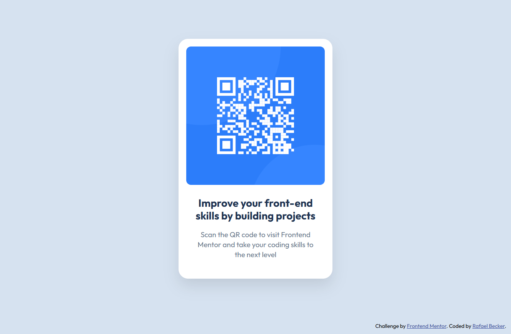

# Frontend Mentor - QR code component solution

This is a solution to the [QR code component challenge on Frontend Mentor](https://www.frontendmentor.io/challenges/qr-code-component-iux_sIO_H). Frontend Mentor challenges help you improve your coding skills by building realistic projects. 

## Table of contents

- [Overview](#overview)
  - [Screenshot](#screenshot)
  - [Links](#links)
- [My process](#my-process)
  - [Built with](#built-with)
  - [What I learned](#what-i-learned)    
- [Author](#author)


## Overview

### Screenshot



### Links

- Solution URL: [https://github.com/realfabecker/mentor/tree/main/qr-code-component](https://github.com/realfabecker/mentor/tree/main/qr-code-component)
- Live Site URL: [https://realfabecker.github.io/mentor/qr-code-component/](https://realfabecker.github.io/mentor/qr-code-component/)

## My process

### Built with

- Semantic HTML5 markup
- CSS custom properties
- Flexbox

**Note: These are just examples. Delete this note and replace the list above with your own choices**

### What I learned

During the development of this project, I had the opportunity to apply and deepen my knowledge of semantic HTML and modern CSS techniques. The main takeaways were:

#### Structuring with Semantic HTML

The project's foundation was built with a focus on semantics, ensuring the HTML structure was not only visually correct but also meaningful for assistive technologies and search engines.

* `<main>`: Used to wrap the main content of the page—the QR code component—indicating its primary importance in the document's structure
* `<figure>` and `<figcaption>`: The perfect combination for the card. The `<figure>` tag groups the QR code image (``) with its descriptive caption (`<figcaption>`), creating a cohesive and semantically rich content unit.
* `<footer>`: Used to wrap the attribution information. This tag defines a footer for the page, serving as a navigation landmark that facilitates access to authorship information and related links.

####  CSS Reset and Variables

To ensure visual consistency across different browsers and simplify code maintenance, two practices were essential:

* **CSS Reset**: A basic reset was applied to remove default browser styles. This creates a "blank slate," allowing the project's defined styles to be applied predictably.

 ```css
* { 
    margin: 0; 
    padding: 0; 
    box-sizing: border-box; 
}
 ```

* **CSS Custom Properties (Variables)**: The design's colors and other constants were declared as variables in the :root selector. This approach centralizes values, making the code more readable, easier to maintain, and avoids the repetition of "magic numbers.

#### Responsive Typography with rem

One of the most interesting points was implementing responsive fonts using the rem unit.

* **The "62.5% Technique"**: To simplify rem calculations, the document's base font size was set with html `{ font-size: 62.5%; }`. Since the default font size in most browsers is 16px, this declaration redefines it to 10px (16 * 0.625 = 10). This makes the conversion intuitive: 1.5rem equals 15px, 2.2rem equals 22px, and so on

#### Modern Layout with Flexbox and Viewport Units

* **Vertical and Horizontal Centering**: The body was set as a flex container (display: flex) with min-height: 100vh, ensuring it occupies the full height of the screen. The align-items: center and justify-content: center properties were used to perfectly center the QR code component.

* **Column Layout with flex-grow**: The page structure was organized into a column (flex-direction: column). The <main> element was given flex-grow: 1, causing it to expand and occupy all available vertical space, pushing the footer (<footer>) to the bottom of the page. This is a more robust and responsive approach than using position: absolute, which can cause content to overlap on different screen sizes.

## Author

- Website - [Rafael Becker](https://github.com/realfabecker)
- Frontend Mentor - [@realfabecker](https://www.frontendmentor.io/profile/realfabecker)
