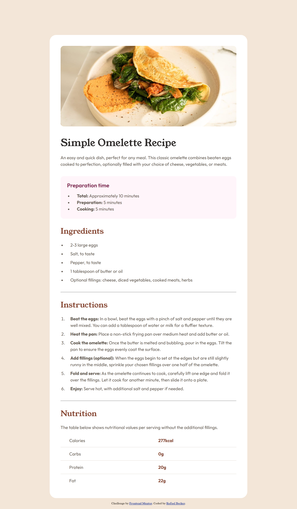

# Frontend Mentor - Recipe page solution

This is a solution to the [Recipe page challenge on Frontend Mentor](https://www.frontendmentor.io/challenges/recipe-page-KiTsR8QQKm). Frontend Mentor challenges help you improve your coding skills by building realistic projects. 

## Table of contents

- [Overview](#overview)
  - [The challenge](#the-challenge)
  - [Screenshot](#screenshot)
  - [Links](#links)
- [My process](#my-process)
  - [Built with](#built-with)
  - [What I learned](#what-i-learned)
- [Author](#author)

## Overview

### Screenshot

### Links

- Solution URL: [https://github.com/realfabecker/mentor/tree/main/recipe-page](https://github.com/realfabecker/mentor/tree/main/recipe-page)
- Live Site URL: [https://realfabecker.github.io/mentor/recipe-page/](https://realfabecker.github.io/mentor/recipe-page/)

## My process

### Built with

- Semantic HTML5 markup
- CSS custom properties
- Flexbox
- Mobile-first workflow

### What I learned

Regarding semantic structure, it was a good opportunity to apply the `<article>` element, with `<section>` sub-elements fitting perfectly to represent each portion of the recipe.

It was also interesting to implement a table with row headers, where the first cell of each row acts as its header. It's important to note the use of the scope="row" attribute here, which helps accessibility tools understand that this is the header for that table row.

The biggest challenge was handling the styling changes at the responsive breakpoint. The design specified that on mobile interfaces, the figure should occupy the full width of the viewport. However, on medium breakpoints and above, it should have a border to maintain white space on the sides.

It took me some time to figure out the solution for this challenge: grouping the image within a <figure> element, making it a sibling to an <article> element containing the recipe. Then, by applying different padding settings to both elements based on the breakpoint, I was able to achieve a result similar to the one projected in the design.

## Author

- Website - [Rafael Becker](https://github.com/realfabecker)
- Frontend Mentor - [@realfabecker](https://www.frontendmentor.io/profile/realfabecker)