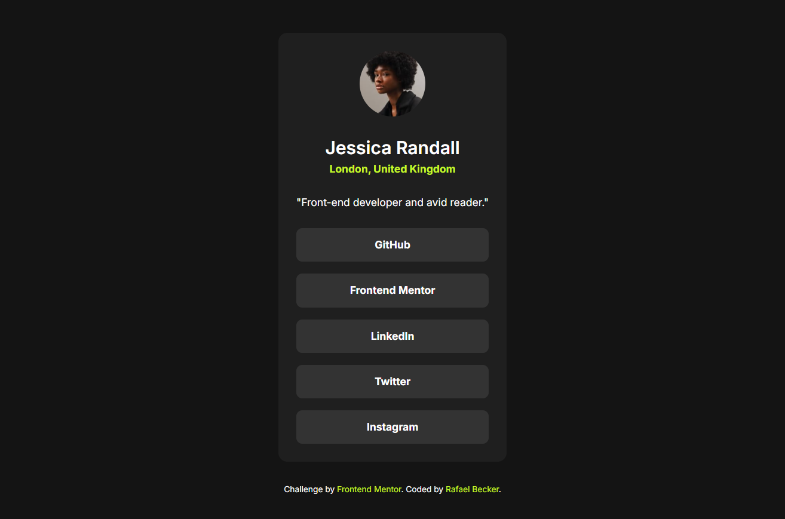

# Frontend Mentor - Social links profile solution

This is a solution to the [Social links profile challenge on Frontend Mentor](https://www.frontendmentor.io/challenges/social-links-profile-UG32l9m6dQ). Frontend Mentor challenges help you improve your coding skills by building realistic projects. 

## Table of contents

- [Overview](#overview)
  - [The challenge](#the-challenge)
  - [Screenshot](#screenshot)
  - [Links](#links)
- [My process](#my-process)
  - [Built with](#built-with)
  - [What I learned](#what-i-learned)
- [Author](#author)

## Overview

### The challenge

Users should be able to:

- See hover and focus states for all interactive elements on the page

### Screenshot

### Links

- Solution URL: [https://github.com/realfabecker/mentor/tree/main/social-links-profile](https://github.com/realfabecker/mentor/tree/main/social-links-profile)
- Live Site URL: [https://realfabecker.github.io/mentor/social-links-profile/](https://realfabecker.github.io/mentor/social-links-profile/)

## My process

### Built with

- Semantic HTML5 markup
- CSS custom properties
- Flexbox
- Mobile-first workflow

### What I learned

Through this project, I was able to reapply semantic HTML concepts, utilizing the `<article>` element to define the main element, as well as `<figure>` to group the image and user name information.

In styling, it was possible to reinforce the concept of variables for reusing colors throughout the project. An interesting concept derived from this was the use of the font tag's value as a variable, which allows grouping the font-weight, size, line-height, and font-family, simplifying its reuse and increasing its readability.

Styling the focus event on the clickable item corresponding to the link within the user's social links item brought a very cool challenge, which was the coloring of the background of the li that contained it. 

This was accomplished through the use of the `:focus-within` pseudo-class selector, which allows capturing an item when it or any element in its tree has been targeted by user focus.

## Author

- Website - [Rafael Becker](https://github.com/realfabecker)
- Frontend Mentor - [@realfabecker](https://www.frontendmentor.io/profile/realfabecker)